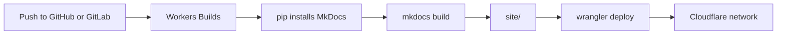

# Deploy with Cloudflare Workers

This site runs on **Workers Static Assets**. MkDocs creates HTML, CSS, JavaScript, and image files in `site/`; Wrangler uploads those files to Cloudflare's global network. There is no server-side Worker code in this project.



## What is already configured

| File | Purpose |
| --- | --- |
| `wrangler.jsonc` | Names the Worker and tells Cloudflare to publish `site/` |
| `requirements.txt` | Installs the same Material for MkDocs version in Cloudflare's build environment |
| `.python-version` | Selects Python 3.12 for local and cloud builds |
| `package.json` | Pins Wrangler and provides local preview and deployment commands |
| `docs/_headers` | Adds security headers and long-lived caching for fingerprinted theme assets |

The asset settings preserve the URL structure MkDocs expects:

```json
"assets": {
  "directory": "./site",
  "not_found_handling": "404-page",
  "html_handling": "auto-trailing-slash"
}
```

`404-page` returns the generated Material 404 page with an actual HTTP 404 status. `auto-trailing-slash` serves directory pages such as `/guide/` at their canonical URLs.

## Recommended: deploy from Git

First, create a GitHub or GitLab repository and push this project to its `main` branch. In the Cloudflare dashboard:

1. Open **Workers & Pages**.
2. Select **Create application**.
3. Under **Import a repository**, connect GitHub or GitLab.
4. Choose the repository containing this project.
5. Confirm that the Worker name is `report-wiki`. It must match `name` in `wrangler.jsonc`.
6. Enter the build settings below and select **Save and Deploy**.

| Setting | Value |
| --- | --- |
| Production branch | `main` |
| Build command | `pip install -r requirements.txt && mkdocs build --strict` |
| Deploy command | `npx wrangler deploy` |
| Non-production deploy command | `npx wrangler versions upload` |
| Root directory | `/` |

The `.python-version` file selects Python 3.12, so a dashboard environment variable is not required. Each push to `main` builds and publishes the production site. Non-production branches can produce version previews for review.

## Preview through the Workers runtime

MkDocs' live server is best while writing:

```bash
uv run mkdocs serve
```

Before publishing, test the generated site through Wrangler's local Workers runtime:

```bash
npm install
npm run preview:worker
```

Wrangler prints the local URL in the terminal. This preview verifies Cloudflare-specific routing and headers against the generated `site/` directory.

## Deploy from this computer

Use this for the first deployment or an intentional manual release:

```bash
npx wrangler login
npm run deploy
```

`wrangler login` opens Cloudflare's authorization page. The deployment command builds the docs strictly, then uploads `site/`. The Worker becomes available at a URL shaped like:

```text
https://report-wiki.<your-account-subdomain>.workers.dev
```

!!! warning "Choose one release owner"
    If Git integration is enabled, use pushes to `main` for routine production releases. Reserve manual deployment for recovery or deliberate testing so the deployed version remains traceable to the repository.

## Add a custom domain

The domain must be in a Cloudflare-managed DNS zone. In the dashboard:

1. Open the `report-wiki` Worker.
2. Go to **Settings → Domains & Routes**.
3. Select **Add → Custom Domain**.
4. Enter a hostname such as `docs.example.com`.

Cloudflare creates the DNS record and TLS certificate. Do not add a `routes` entry to `wrangler.jsonc` until the final domain is known; keeping account-specific domain configuration out of the repository prevents accidental changes during local testing.

After the domain works, add its canonical URL near the top of `mkdocs.yml`:

```yaml
site_url: https://docs.example.com/
```

This lets MkDocs generate the correct canonical URLs and sitemap for search engines.

## Costs and limits

Static asset requests are free and unlimited. The Free plan currently allows 20,000 static files per Worker version, with a 25 MiB limit for each file. Workers Builds includes 3,000 build minutes per month, one concurrent build, and a 20-minute build timeout.

Worker request quotas matter only after server-side Worker code is introduced or asset requests are deliberately routed through code. This static-only configuration serves matching assets directly.

## Common problems

### The deployment says the Worker name does not match

Use `report-wiki` as the project name in Cloudflare, or change `name` in `wrangler.jsonc` before the first deployment.

### Cloudflare publishes an old page

Check that `mkdocs build --strict` ran before `wrangler deploy`. In Git deployments, inspect the build log and confirm the build command completed successfully.

### A missing path shows the wrong page

Keep `not_found_handling` set to `404-page`. MkDocs is a multi-page static site, so the `single-page-application` option is inappropriate.

### The custom domain cannot be added

Confirm that its DNS zone is active in the same Cloudflare account and that no conflicting CNAME already occupies the hostname.

## Official references

- [Workers Static Assets](https://developers.cloudflare.com/workers/static-assets/)
- [Static-site generation and 404 behavior](https://developers.cloudflare.com/workers/static-assets/routing/static-site-generation/)
- [Workers Builds configuration](https://developers.cloudflare.com/workers/ci-cd/builds/configuration/)
- [Git integration](https://developers.cloudflare.com/workers/ci-cd/builds/git-integration/)
- [Custom Domains](https://developers.cloudflare.com/workers/configuration/routing/custom-domains/)
- [Static asset billing and limitations](https://developers.cloudflare.com/workers/static-assets/billing-and-limitations/)
