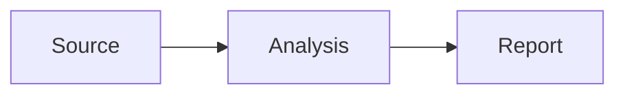

# Material components

This site uses [Material for MkDocs](https://squidfunk.github.io/mkdocs-material/). Many of its colorful elements are written in Markdown and styled by the theme. The examples below work with this site's current `mkdocs.yml`; copy the source into any page under `docs/`.

For the full catalog, start with the [official Material reference](https://squidfunk.github.io/mkdocs-material/reference/). The sections below link to the specific documentation for each component.

## Callouts and collapsible details

Use callouts for context, tips, and warnings. Use a collapsible detail when the information is useful but optional. See [admonitions](https://squidfunk.github.io/mkdocs-material/reference/admonitions/).

!!! tip "Writing tip"
    Put the main point first, then add supporting detail.

!!! warning "Check the source"
    Verify figures before publishing a report.

!!! question "Question"
    基于这个理解，我们接下来关注几个问题：

    1. 如何形式化描述 Forward 和 Reverse 这两个过程？
    2. 在 Training 和 Inference 中，Forward 和 Reverse 这两个阶段如何参与？

??? note "Why this matters"
    Readers can open this explanation when they need it.

```markdown
!!! tip "Writing tip"
    Put the main point first, then add supporting detail.

!!! warning "Check the source"
    Verify figures before publishing a report.

!!! question "Question"
    基于这个理解，我们接下来关注几个问题：

    1. 如何形式化描述 Forward 和 Reverse 这两个过程？
    2. 在 Training 和 Inference 中，Forward 和 Reverse 这两个阶段如何参与？

??? note "Why this matters"
    Readers can open this explanation when they need it.
```

Indent everything inside the block by four spaces, including list items, and leave a blank line before the list. Other built-in types include `info`, `success`, `danger`, `bug`, and `example`.

## Content tabs

Tabs group alternative versions of the same information, such as commands for different tools. See [content tabs](https://squidfunk.github.io/mkdocs-material/reference/content-tabs/).

=== "uv"
    Run `uv run mkdocs serve` to preview the site.

=== "Python"
    Run `python -m mkdocs serve` in an environment with the dependencies installed.

```markdown
=== "uv"
    Run `uv run mkdocs serve` to preview the site.

=== "Python"
    Run `python -m mkdocs serve` in an environment with the dependencies installed.
```

## Buttons

Buttons make a primary next step stand out. They are ordinary links with Material CSS classes; use a real destination. See [buttons](https://squidfunk.github.io/mkdocs-material/reference/buttons/).

[Read the writing guide](index.md){ .md-button .md-button--primary }
[Browse Markdown examples](markdown-examples.md){ .md-button }

```markdown
[Read the writing guide](index.md){ .md-button .md-button--primary }
[Browse Markdown examples](markdown-examples.md){ .md-button }
```

## Icons and emoji

Material bundles several icon sets. Use a shortcode in text, links, or cards; the [icon and emoji reference](https://squidfunk.github.io/mkdocs-material/reference/icons-emojis/) has a searchable catalog.

:material-lightbulb: A useful idea. :material-check-circle: A completed step. :smile: A friendly note.

```markdown
:material-lightbulb: A useful idea. :material-check-circle: A completed step. :smile: A friendly note.
```

## Card grids

Cards work well for an overview page with a few equal choices. The grid adapts to narrow screens. See [grids](https://squidfunk.github.io/mkdocs-material/reference/grids/).

<div class="grid cards" markdown>

-   **Write a page**

    ---

    Start with a clear title and a short summary.

    [Add and edit content](index.md)

-   **Organize pages**

    ---

    Place related pages together in the navigation.

    [Organize navigation](navigation.md)

</div>

```html
<div class="grid cards" markdown>

-   **Write a page**

    ---

    Start with a clear title and a short summary.

    [Add and edit content](index.md)

-   **Organize pages**

    ---

    Place related pages together in the navigation.

    [Organize navigation](navigation.md)

</div>
```

## Code blocks

Add a language for syntax colors, a title for context, and line highlighting to draw attention to a step. This site also shows copy and line-selection controls. See [code blocks](https://squidfunk.github.io/mkdocs-material/reference/code-blocks/).

```python title="report.py" linenums="1" hl_lines="2"
results = [72, 81, 85]
target = 85
print(results[-1] >= target)
```

````markdown
```python title="report.py" linenums="1" hl_lines="2"
results = [72, 81, 85]
target = 85
print(results[-1] >= target)
```
````

## Diagrams

Write Mermaid inside a fenced code block for a simple flowchart. Material applies the site's light and dark colors. See [diagrams](https://squidfunk.github.io/mkdocs-material/reference/diagrams/).



````markdown

````

## Tables and inline emphasis

Tables compare structured values. `==highlighted text==` calls out a short phrase, and `++ctrl+s++` displays keyboard keys. See [data tables](https://squidfunk.github.io/mkdocs-material/reference/data-tables/) and [formatting](https://squidfunk.github.io/mkdocs-material/reference/formatting/).

| Metric | Current | Target |
| --- | ---: | ---: |
| Completion rate | 72% | 85% |
| Review time | 4 days | 2 days |

Use ==highlighting== sparingly. Press ++ctrl+s++ to save a file.

```markdown
| Metric | Current | Target |
| --- | ---: | ---: |
| Completion rate | 72% | 85% |
| Review time | 4 days | 2 days |

Use ==highlighting== sparingly. Press ++ctrl+s++ to save a file.
```
