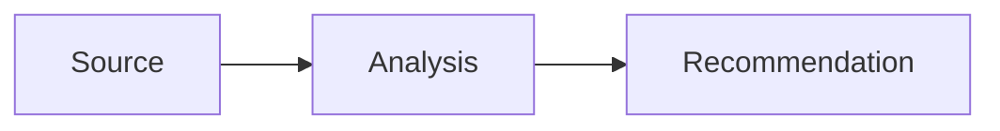

# Markdown examples

This page doubles as a formatting reference and a visual test for the theme.

## Text and links

```markdown
Use **bold** for emphasis, *italics* for a term, and `code` for a literal value.

Visit the [project brief](https://chatgpt.com/share/6aab766a-b104-83ec-b3d3-c22c2887cf3c).
```

## Callouts

```markdown
!!! note "Context"
    Add background information here.

!!! warning "Check before publishing"
    Add a condition the reader must verify.

??? tip "Optional detail"
    This content is collapsed until the reader opens it.
```

!!! note "Context"
    Add background information here.

!!! warning "Check before publishing"
    Add a condition the reader must verify.

??? tip "Optional detail"
    This content is collapsed until the reader opens it.

## Tables

```markdown
| Metric | Current | Target |
| --- | ---: | ---: |
| Completion rate | 72% | 85% |
| Review time | 4 days | 2 days |
```

| Metric | Current | Target |
| --- | ---: | ---: |
| Completion rate | 72% | 85% |
| Review time | 4 days | 2 days |

## Tabs

```markdown
=== "Summary"
    Put the concise version here.

=== "Details"
    Put supporting material here.
```

=== "Summary"
    Put the concise version here.

=== "Details"
    Put supporting material here.

## Diagrams

````markdown

````


