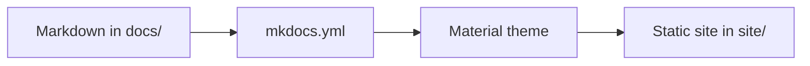

# Report Wiki

Everything the team needs to understand, write, and maintain the report—kept in one searchable place.

  This starter site follows the layout and interaction patterns of the
  <a href="https://wiki.metacubex.one/en/" target="_blank" rel="noopener">mihomo documentation</a>:
  top-level tabs, nested navigation, a page outline, full-text search, dark mode, and copyable code blocks.

-   **Start here**

    ---

    Preview the wiki locally and learn where every file belongs.

    [Run the site →](getting-started/run-the-site.md)

-   **Write a page**

    ---

    Add headings, links, callouts, tables, diagrams, and code examples in Markdown.

    [Open the writing guide →](guide/index.md)

-   **Use the project brief**

    ---

    Keep content aligned with the shared ChatGPT conversation that defines the project.

    [View the source brief →](reference/project-brief.md)

## How this wiki works

Each page is a Markdown file under `docs/`. The menu lives in `mkdocs.yml`. MkDocs combines those files with the Material theme and produces a static website in `site/`.

!!! tip "Your first edit"
    Open `docs/index.md`, change the first paragraph, save it, and refresh the local preview. MkDocs normally reloads the browser automatically.

## Suggested content map

| Area | What belongs there |
| --- | --- |
| Getting started | Setup, prerequisites, and the shortest path to a useful result |
| Writing guide | Instructions for people who maintain this wiki |
| Project reference | Requirements, decisions, data definitions, and source material |
| New sections | Findings, methodology, analysis, recommendations, or appendices |

